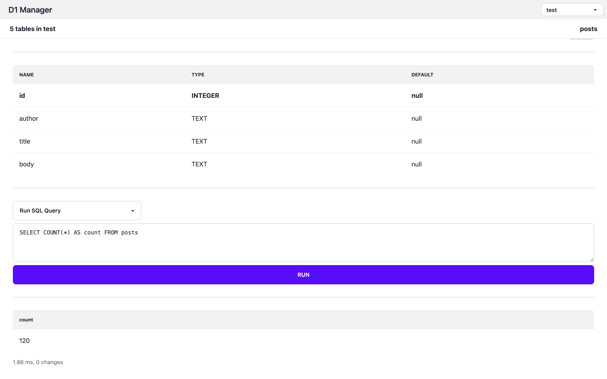
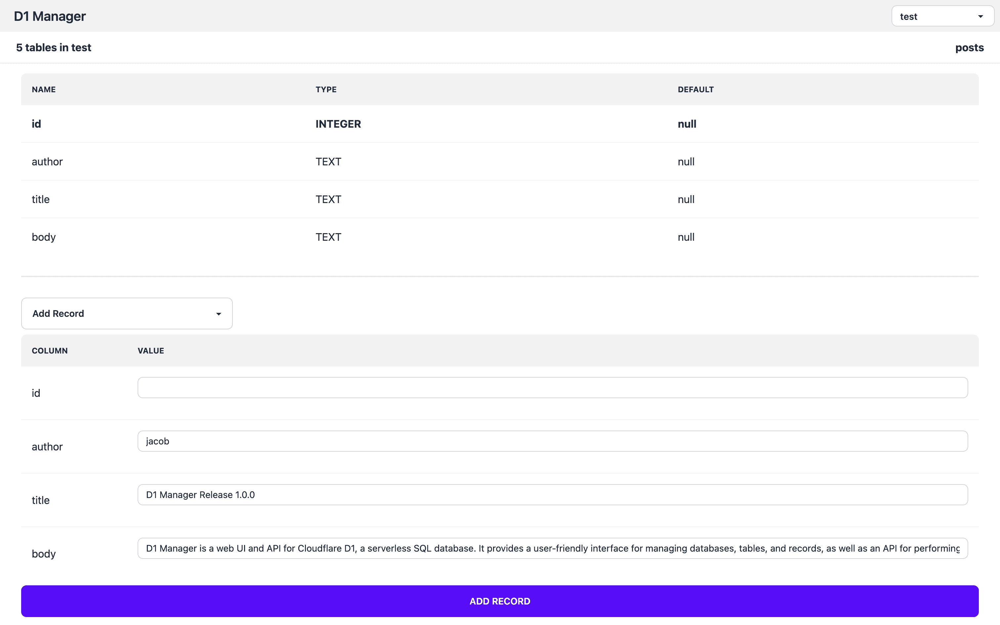

> [!NOTE]  
> This project has been cloned from https://github.com/JacobLinCool/d1-manager. It is a tool to provide a simple UI to get insights into the current state of the Menteka database, and to quickly update values. It is deployed at db.menteka.com, but access is highly restricted.

Small changes made to fit into this repo: 
- Removed all git settings, changeset, github, etc
- Change package manager to npm

# D1 Manager

D1 Manager is a web UI and API for Cloudflare D1, a serverless SQL database. It provides a user-friendly interface for managing databases, tables, and records, as well as an API for performing operations programmatically. D1 Manager simplifies database management, enabling users to focus on their data.

## Features

-   [x] Multiple D1 Databases
-   [x] List all tables in a database
-   [x] Show table schema
-   [x] Run SQL queries
-   [x] Run Semantic Queries (OpenAI API or Cloudflare AI Worker)
-   [x] Edit table data through UI
-   [x] I18n support (English, Chinese, Spanish, Japanese) [add more](./locales/) ([Online Editor](https://fink.inlang.com/github.com/JacobLinCool/d1-manager))
-   [x] API support (see [routes/api](./src/routes/api/) for details)

## Setup

1. Fork this repo
2. Setup a **Cloudflare Pages** with the forked repo
   - Select the **SveltKit** framework preset.
   - Build command: `npm run build`
   - Build output directory: `.svelte-kit/cloudflare`
4. Use **Cloudflare Access** to protect the your site
   - The default access rules only restrict access to preview pages, so make sure to add other urls you want protected.
6. **Bind databases** to `DB_*` environment variables

> Note: You can bind multiple databases to the manager. In theis example, `DB` will be `default` in the UI, and `DB_test` will be `test`.

### Environment Variables

Some plugins (e.g. Semantic Query) require additional environment variables to be set.

Also, there are some configuration options that can be set through environment variables.

- `SHOW_INTERNAL_TABLES`: Show internal tables (`splite_*` and `d1_*`) in the UI.

#### Semantic Query

You can use OpenAI API or Cloudflare AI Worker to run Semantic Query.

OpenAI API:

- `OPENAI_API_KEY`: OpenAI API key for Semantic Query.
- `OPENAI_API_URL`: You may use this with Cloudflare AI Gateway to proxy requests to OpenAI API.
- `OPENAI_MODEL`: OpenAI API model for Semantic Query. Default to `gpt-3.5-turbo-1106`.

Cloudflare AI Worker:

- `AI`: Bind a Cloudflare AI Worker to this variable.
- `CFAI_MODEL`: Cloudflare AI Worker model for Semantic Query. Default to `@cf/mistral/mistral-7b-instruct-v0.1`.

## Screenshots

> Semantic Query uses OpenAI GPT-3.5 Turbo to translate natural language queries into SQL.
